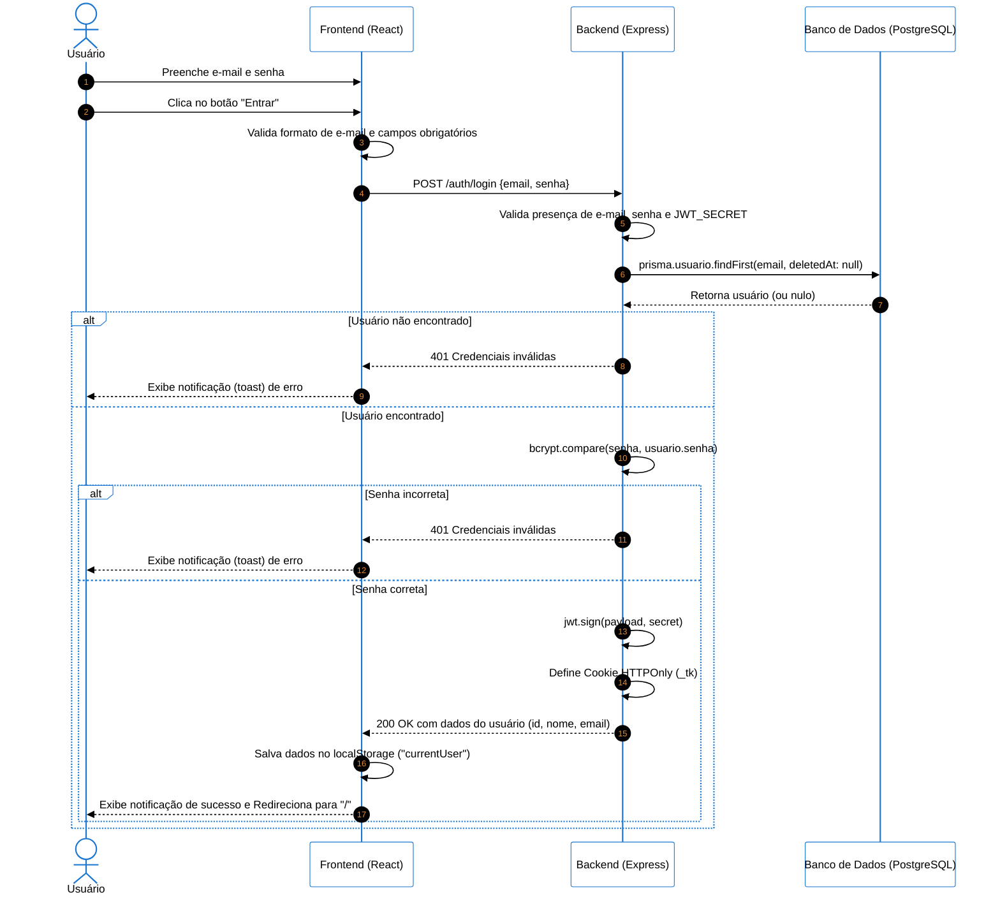

# Gestão de Tarefas Colaborativas 🚀

Este projeto consiste em uma aplicação web full-stack voltada para a **Gestão de Tarefas Colaborativas**. Desenvolvido como o Trabalho do Grau B (GB) para a disciplina de Engenharia de Software da UNISINOS, o sistema foi projetado sob rigorosos padrões arquiteturais, com forte foco em segurança, modularidade e garantia de qualidade através de testes automatizados.

---

## 🛠️ Stack Tecnológica

A stack do projeto foi selecionada estrategicamente visando produtividade, forte tipagem e alta manutenibilidade:

### Frontend
🎯 Interfaces ricas, responsivas e fortemente tipadas.

    

> **Nota:** Gerenciamento de notificações assíncronas implementado através da biblioteca **Sonner** (Toasts).

### Backend & API
⚡ Servidor robusto estruturado sob o padrão MVC.

  

### Banco de Dados & ORM
🗄️ Persistência de dados relacional com provisionamento em nuvem.

  

### Testes Automatizados
🧪 Garantia de qualidade, segurança e integridade das rotas.


---

## 📌 Funcionalidades Principais

* **Autenticação Segura:** Sistema de login com validação de campos obrigatórios, criptografia de senhas via `bcrypt` e gerenciamento de sessões utilizando tokens JWT injetados em Cookies `HTTPOnly` (`tk`).
* **Gerenciamento de Usuários:** Cadastro, listagem e controle detalhado de perfis de usuários com suporte a desativação lógica (*soft delete*).
* **Painel de Tarefas (Dashboard):** Visualização unificada e intuitiva sobre o andamento e distribuição das demandas.
* **Gestão de Tarefas:** Criação, edição, atribuição e atualização de status (Pendente, Em Andamento, Concluída) de tarefas vinculadas diretamente aos usuários.

---

## 📐 Arquitetura do Sistema

A aplicação adota o padrão de arquitetura **MVC (Model-View-Controller)** de forma distribuída:

1. **Model:** Camada sob responsabilidade do Prisma ORM, mapeando as entidades do banco de dados e gerenciando as comunicações com o PostgreSQL.
2. **Controller:** Controladores robustos no Express (`auth.ts`, `tarefas.ts`, `usuarios.ts`) que validam os dados recebidos, orquestram as regras de negócio e formulam a resposta da API.
3. **View:** Uma interface rica e responsiva em React que consome os endpoints expostos pelo servidor.

---

## 🗄️ Modelagem do Banco de Dados

O banco de dados relacional PostgreSQL possui duas entidades principais correlacionadas:

### Tabela `usuarios`
* `id` (PK, Integer, Auto-incremento)
* `nome` (String)
* `email` (String, Único)
* `senha` (String, Hash criptografado)
* `createdAt` / `updatedAt` (Timestamps)

### Tabela `tarefas`
* `id` (PK, Integer, Auto-incremento)
* `nome` (String)
* `descricao` (Text)
* `status` (String)
* `deUsuario` (FK, referenciando `usuarios.id`)
* `createdAt` / `updatedAt` (Timestamps)

---

## 🛣️ Endpoints da API

A API está estruturada em três domínios principais. Todas as requisições protegidas esperam a validação do token JWT injetado de forma segura no navegador.

### 🔐 Autenticação

| Método | Endpoint | Descrição |
| :--- | :--- | :--- |
| `POST` | `/auth/login` | Realiza a autenticação do usuário. Valida o e-mail/senha e retorna o token JWT estruturado dentro de um cookie seguro (`HTTPOnly`). |
| `POST` | `/auth/logout` | Revoga a sessão atual do usuário limpando o cookie de autenticação. |

### 👥 Usuários

| Método | Endpoint | Descrição |
| :--- | :--- | :--- |
| `POST` | `/usuarios` | Cria um novo usuário no sistema. Valida duplicidade de e-mail e armazena a senha com criptografia `bcrypt`. |
| `GET` | `/usuarios/{id}` | Retorna os dados cadastrais (exceto a senha) de um usuário específico através do ID fornecido. |
| `PUT` | `/usuarios/{id}` | Atualiza informações cadastrais do usuário correspondente ao ID. |
| `DELETE` | `/usuarios/{id}` | Remove o usuário do sistema através de política de *soft delete* (mantendo o histórico no banco de dados). |

### 📋 Tarefas

| Método | Endpoint | Descrição |
| :--- | :--- | :--- |
| `POST` | `/tasks` | Cria uma nova tarefa associada a um usuário responsável. |
| `GET` | `/tasks/{id}` | Recupera os detalhes completos de uma tarefa específica. |
| `GET` | `/tasks?assignedTo={userId}` | Filtra e lista todas as tarefas ativas atribuídas a um determinado ID de usuário. |
| `PUT` | `/tasks/{id}` | Atualiza as propriedades da tarefa (como título, descrição ou alteração do estado atual do `status`). |
| `DELETE` | `/tasks/{id}` | Exclui permanentemente uma tarefa do banco de dados. |

---

## 📁 Estrutura de Diretórios

```text
Gestao_de_tarefas-engenharia_de_software-main/
├── Back/                          # Servidor e regras de negócio da API
│   ├── prisma/                    # Arquivos do ORM e Migrações
│   │   ├── schema.prisma          # Definição e relacionamentos do banco
│   │   └── migrations/            # Histórico estrutural de scripts SQL
│   ├── src/
│   │   ├── controllers/           # Controladores (auth, tarefas, usuarios)
│   │   ├── router/                # Definição e mapeamento de rotas
│   │   ├── prisma.ts              # Instanciação do Cliente Prisma
│   │   └── server.ts              # Inicialização e escuta do servidor Express
│   ├── package.json
│   └── tsconfig.json
├── Front/                         # Interface de Usuário (SPA)
│   └── gestaoTarefas/
│       ├── src/
│       │   ├── components/        # Componentes estruturados por contexto (ui, tarefas, usuarios, login)
│       │   ├── lib/               # Configurações utilitárias (Tailwind/Shadcn)
│       │   ├── App.tsx            # Componente raiz global
│       │   ├── layout.tsx         # Estrutura de posicionamento (Sidebar, Header)
│       │   └── main.tsx           # Ponto de montagem do React na DOM
│       ├── index.html
│       ├── package.json
│       └── vite.config.ts
└── README.md                      # Documentação oficial do repositório

```

---

## 🚀 Instruções de Instalação e Execução

### Pré-requisitos

* **Node.js** (versão LTS) instalado localmente.
* Uma instância ativa de banco de dados PostgreSQL (ou credenciais do Neon Database).

### 1. Configurando o Backend (API)

```bash
# Navegar até o diretório do backend
cd Back

# Instalar as dependências do ecossistema Node
npm install

```

Crie uma cópia do arquivo `.env.example` na raiz da pasta `Back` e altere seu nome para `.env`.

Execute as migrações estruturais do Prisma e inicie o servidor local:

```bash
# Rodar migrações do Prisma para estruturar as tabelas
npx prisma migrate dev

# Iniciar o servidor em ambiente de desenvolvimento
npm run dev

```

### 2. Configurando o Frontend

Em uma nova janela do terminal, acesse a pasta da aplicação cliente:

```bash
# Navegar até o diretório do frontend
cd Front/gestaoTarefas

# Instalar as dependências necessárias
npm install

# Iniciar a aplicação local com o Vite
npm run dev

```

A aplicação estará disponível em `http://localhost:5173`.

---

### 📈 Diagrama de Sequência



---

### Testes

Foram executados testes automatizados na aplicação utilizando-se da tecnologia Jest.

```bash
# No backend
npm run test

```
Será retornado uma bateria de testes automátizados 

## 👥 Autores

Trabalho prático desenvolvido por:

* **Artur Brenner**
* **Bianca Franzon**
* **Tobias Klein**

